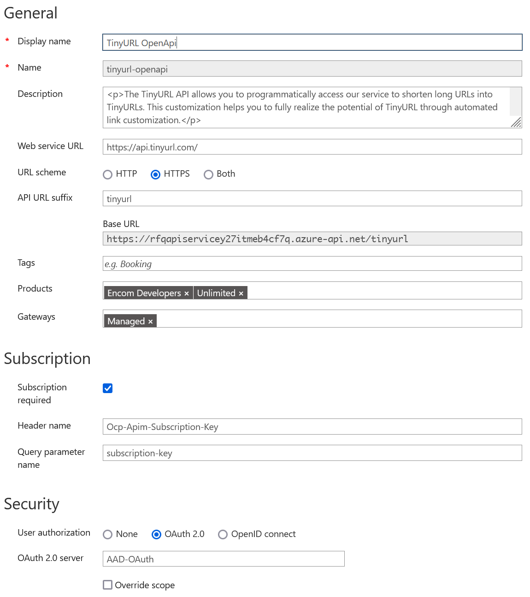
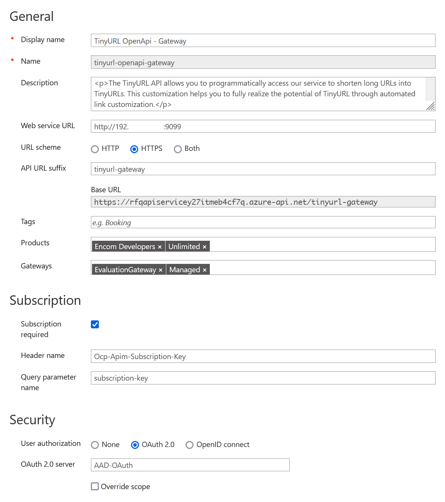
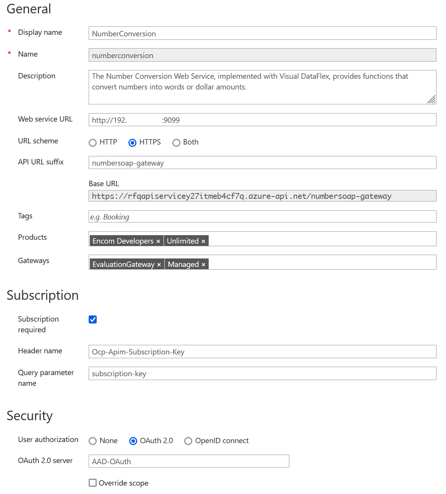
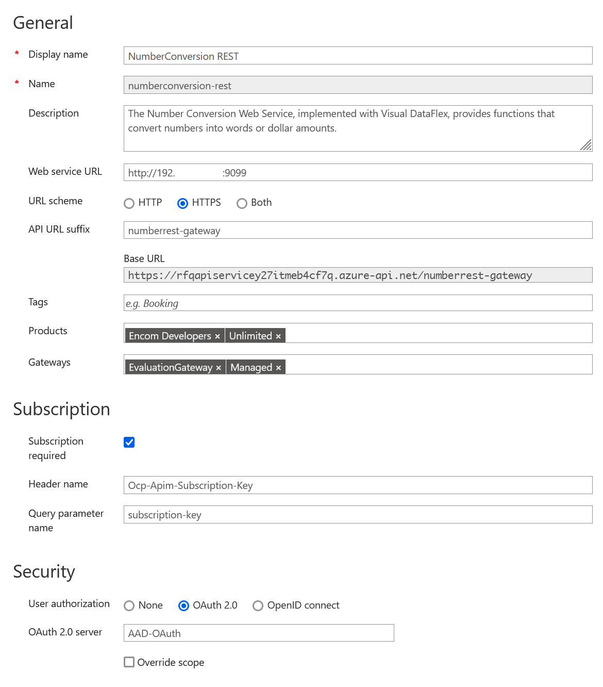
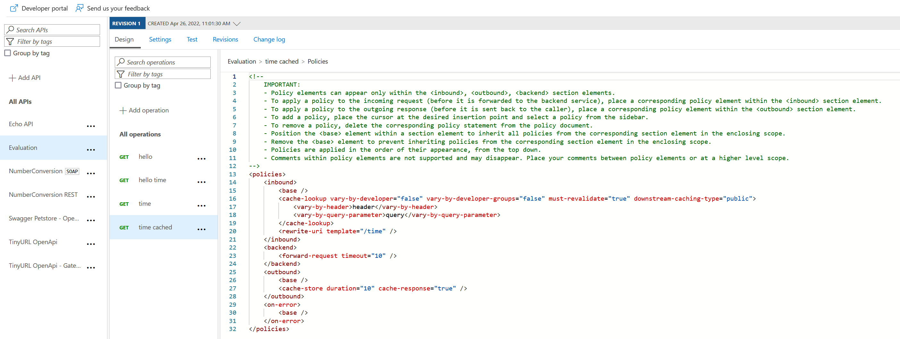

# Use Cases

## 1 OpenApi v3

Adding an existing service with OpenAPI v3 API document to the gateway

- Cloud service (control / data plane)
- On-premise service (data plane)

[Import an OpenAPI specification](https://docs.microsoft.com/en-us/azure/api-management/import-api-from-oas#-import-and-publish-a-back-end-api)

[TinyUrl - OpenApi](https://tinyurl.com/openapi/v2.json)

--------------

### 1.1 Cloud service (control / data plane)

#### 1.1.1 Import OpenApi

Use _tinyurl.openapi.json_

API Url suffix: tinyurl  
Products: Unlimited

Security: OAuth 2



#### 1.1.2 POST /create - Policy

```xml
<policies>
    <inbound>
        <validate-jwt header-name="Authorization" failed-validation-httpcode="401" failed-validation-error-message="Unauthorized. Access token is missing or invalid.">
            <openid-config url="https://login.microsoftonline.com/your-tenant-guid/.well-known/openid-configuration" />
            <required-claims>
                <claim name="aud">
                    <value>00000002-0000-0000-c000-000000000000</value>
                </claim>
            </required-claims>
        </validate-jwt>        
        <set-query-parameter name="api_token" exists-action="override">
            <value>{{TinyUrlKey}}</value>
        </set-query-parameter>
        <base />
    </inbound>
    <backend>
        <base />
    </backend>
    <outbound>
        <base />
    </outbound>
    <on-error>
        <base />
    </on-error>
</policies>
```

#### 1.1.3 TEST

```bash
curl 'https://rfqapiservicey27itqpt4cf7q.azure-api.net/tinyurl/create' -H 'Ocp-Apim-Subscription-Key: your-key' -H 'Ocp-Apim-Trace: true' -H 'Content-Type: application/json' --data "@tinyurl.request.json" -H "Authorization: Bearer eyJ0e...."
```

ResponseBody:

```json
{"data":{"domain":"tinyurl.com","alias":"y926fh2b","deleted":false,"archived":false,"analytics":{"enabled":true,"public":false},"tags":[],"created_at":"2022-04-25T08:27:11.000000Z","expires_at":null,"tiny_url":"https:\/\/tinyurl.com\/y926fh2b","url":"https:\/\/www.example.com\/my-really-long-link-that-I-need-to-shorten\/84378949"},"code":0,"errors":[]}
```

--------------

### 1.2 On-premise service (data plane)

#### 1.2.1 Import OpenApi

Use _tinyurl.openapi.json_

Display name: TinyURL OpenApi - Gateway  
API Url suffix: tinyurl-gateway  
Web service URL: <http://192.0.0.0:9099>  
-> Url of On-Premise system

Products: Unlimited  
Gateway: EvaluationGateway  



#### 1.2.2 POST /create - Policy

```xml
<policies>
    <inbound>
        <base />
        <validate-jwt header-name="Authorization" failed-validation-httpcode="401" failed-validation-error-message="Unauthorized. Access token is missing or invalid.">
            <openid-config url="https://login.microsoftonline.com/your-tenant-guid/.well-known/openid-configuration" />
        </validate-jwt>        
        <rewrite-uri template="/tinyurl.json" copy-unmatched-params="true" />
    </inbound>
    <backend>
        <base />
    </backend>
    <outbound>
        <base />
    </outbound>
    <on-error>
        <base />
    </on-error>
</policies>
```

#### 1.2.3 TEST

```bash
curl "Content-Type: application/json" -H "Ocp-Apim-Subscription-Key:your-key" -H "Ocp-Apim-Trace:true" --data "@tinyurl.request.json" --insecure https://localhost:443/tinyurl-gateway/create -H "Authorization: Bearer eyJ0e...."
```

ResponseBody:

```json
{
    "data": {
        "domain": "tinyurl.com",
        "alias": "2s3xj48u",
        "deleted": false,
        "archived": false,
        "analytics": {
            "enabled": true,
            "public": false
        },
        "tags": [],
        "created_at": "2022-04-25T09:38:15.000000Z",
        "expires_at": null,
        "tiny_url": "https://tinyurl.com/2s3xj48u",
        "url": "https://www.planb.net"
    },
    "code": 0,
    "errors": []
}
```

## 2 SOAP WSDL

Adding an existing SOAP service with WSDL

- On-premise service (data plane)

### 2.1 Import WSDL

Adding an existing SOAP service with WSDL.

[Import SOAP API to API Management](https://docs.microsoft.com/en-us/azure/api-management/import-soap-api)  

The free online SOAP Number Conversion Service will be used for demonstration purpose.

[Number Conversion Service](https://www.dataaccess.com/webservicesserver/NumberConversion.wso?op=NumberToWords)

[Number Conversion Service - WSDL](https://www.dataaccess.com/webservicesserver/NumberConversion.wso?WSDL)

Web service URL: <http://192.0.0.0:9099>  
-> Url of On-Premise system

Products: Unlimited  
Gateway: EvaluationGateway  
API URL suffix: numbersoap-gateway



### 2.2 POST /?soapAction=NumberToWords - Policy

```xml
<policies>
    <inbound>
        <base />
        <validate-jwt header-name="Authorization" failed-validation-httpcode="401" failed-validation-error-message="Unauthorized. Access token is missing or invalid.">
            <openid-config url="https://login.microsoftonline.com/your-tenant-guid/.well-known/openid-configuration" />
        </validate-jwt>
        <rewrite-uri template="/numbers.xml" copy-unmatched-params="true" />
    </inbound>
    <backend>
        <base />
    </backend>
    <outbound>
        <base />
    </outbound>
    <on-error>
        <base />
    </on-error>
</policies>
```

### 2.3 TEST

Test original webservice:

```bash
curl -X POST -H "Content-Type: text/xml" -H 'SOAPAction: "NumberToWords"' --data-binary "@numberrequest.xml" https://www.dataaccess.com/webservicesserver/NumberConversion.wso
```

Test on-premise webservice:

```bash
curl -X POST -H "Content-Type: text/xml" -H 'SOAPAction: "NumberToWords"' -H "Ocp-Apim-Subscription-Key:your-key" -H "Ocp-Apim-Trace:true" --data-binary "@numberrequest.xml" --insecure https://localhost:443/numbersoap-gateway -H "Authorization: Bearer eyJ0e...."
```

ResponseBody:

```xml
<?xml version="1.0" encoding="utf-8"?>
<soap:Envelope xmlns:soap="http://schemas.xmlsoap.org/soap/envelope/">
  <soap:Body>
    <m:NumberToWordsResponse xmlns:m="http://www.dataaccess.com/webservicesserver/">
      <m:NumberToWordsResult>forty two </m:NumberToWordsResult>
    </m:NumberToWordsResponse>
  </soap:Body>
</soap:Envelope>
```

## 3 Expose SOAP as REST

### 3.1 Import WSDL

Adding an existing SOAP service with WSDL.

[Import SOAP API to API Management and convert to REST](https://docs.microsoft.com/en-us/azure/api-management/restify-soap-api)

The free online SOAP Number Conversion Service will be used for demonstration purpose.

[Number Conversion Service](https://www.dataaccess.com/webservicesserver/NumberConversion.wso?op=NumberToWords)

[Number Conversion Service - WSDL](https://www.dataaccess.com/webservicesserver/NumberConversion.wso?WSDL)

Web service URL: <http://192.0.0.0:9099>  
-> Url of On-Premise system

Products: Unlimited  
Gateway: EvaluationGateway  
API URL suffix: numberrest-gateway  



### 3.2 POST /NumberToWords - Policy

```xml
    <inbound>
        <base />
        <validate-jwt header-name="Authorization" failed-validation-httpcode="401" failed-validation-error-message="Unauthorized. Access token is missing or invalid.">
            <openid-config url="https://login.microsoftonline.com/your-tenant-guid/.well-known/openid-configuration" />
        </validate-jwt>
        <rewrite-uri template="/numbers.xml" copy-unmatched-params="true" />
        <!--
        <rewrite-uri template="/webservicesserver/NumberConversion.wso" copy-unmatched-params="false" />
        -->
```

### 3.3 TEST

Test on-premise webservice:

```bash
curl "Content-Type: application/json" -H "Ocp-Apim-Subscription-Key:your-key" -H "Ocp-Apim-Trace:true" --data "@numberrequest.json" --insecure https://localhost:443/numberrest-gateway/NumberToWords -H "Authorization: Bearer eyJ0e...."

```

ResponseBody:

```json
{
    "numberToWordsResponse":
    {
        "numberToWordsResult": "forty two "
    }
}
```

### 4 Mock service in API Gateway

- Create mocked endpoints with sample data

[Tutorial: Mock API responses](https://docs.microsoft.com/en-us/azure/api-management/mock-api-responses?tabs=azure-portal)

["Policy - Mock response"](https://docs.microsoft.com/en-us/azure/api-management/api-management-advanced-policies#mock-response)

#### 4.1 Create operation

Operation /evaluation/hello

Mock policy returns example from OpenAPI:

policy:

```xml
<inbound>
    <base />
    <mock-response status-code="200" content-type="application/json" />
</inbound>
```

```yaml

  /hello:
    get:
      summary: hello
      description: hello
      operationId: hello
      responses:
        '200':
          description: OK
          content:
            application/json:
              schema:
                $ref: '#/components/schemas/HelloGet200ApplicationJsonResponse'
              example:
                hello: world
components:
  schemas:
    HelloGet200ApplicationJsonResponse:
      type: object
      properties:
        hello:
          type: string
          example: world

```

#### 4.2 TEST

```bash
curl -X GET https://rfqapiservicey27itqpt4cf7q.azure-api.net/evaluation/hello -H "Ocp-Apim-Subscription-Key:your-key" -H "Ocp-Apim-Trace:true" 
```

ResponseBody:

```json
{
  "hello": "world"
}
```

### 5 RBAC concept

- Add roles/groups
- Integrate Azure AD
- Protect uses cases 1-4

Roles in API Management:

[How to use Role-Based Access Control in Azure API Management](https://docs.microsoft.com/en-us/azure/api-management/api-management-role-based-access-control)

- API Management Service Contributor
- API Management Service Reader
- API Management Service Operator

Groups in API Management Developer Portal:

[How to create and use groups to manage developer accounts in Azure API Management](https://docs.microsoft.com/en-us/azure/api-management/api-management-howto-create-groups)

- Administrators
- Developers
- Guests

#### 5.1 Developer Portal - Configure Azure Active Directory Authentication

[Authorize developer accounts by using Azure Active Directory in Azure API Management](https://docs.microsoft.com/en-us/azure/api-management/api-management-howto-aad)

Execute [corrected script](https://github.com/MicrosoftDocs/azure-docs/issues/92017) for API permissions:

```pwsh
appReg.ps1
```

-> Publish Developer Portal

#### 5.2 APIs - Configure OAuth Authentication

[How to authorize developer accounts using OAuth 2.0 in Azure API Management](https://docs.microsoft.com/en-us/azure/api-management/api-management-howto-oauth2)

[Register another application in Azure AD to represent a client application](https://docs.microsoft.com/en-us/azure/api-management/api-management-howto-protect-backend-with-aad#2-register-another-application-in-azure-ad-to-represent-a-client-application)

> However, what if someone calls your API without a token or with an invalid token?
  For example, if you call the API without the Authorization header, the call will still go through, since API Management does not validate the access token.
  It simply passes the Authorization header to the back-end API.
  Pre-authorize requests in API Management with the Validate JWT policy, by validating the access tokens of each incoming request. If a request does not have a valid token, API Management blocks it.

[Policy - Validate JWT](https://docs.microsoft.com/en-us/azure/api-management/api-management-access-restriction-policies#ValidateJWT)

```xml
<validate-jwt header-name="Authorization" failed-validation-httpcode="401" failed-validation-error-message="Unauthorized. Access token is missing or invalid.">
    <openid-config url="https://login.microsoftonline.com/your-tenant-guid/.well-known/openid-configuration" />
</validate-jwt>
```

-> Publish Developer Portal

## 6 Developer Portal

- Demo (capabilities)
- Transformation
- Group/Join multiple endpoints (from different services) to single API / OpenAPI 3 document for the consuming application/client

### 6.1 Demo

[Overview of the developer portal](https://docs.microsoft.com/en-us/azure/api-management/api-management-howto-developer-portal)

### 6.2 Transformation

Developer Portal does not support transformation.
But in API Management APIs can use transformation policies:  
[API Management transformation policies](https://docs.microsoft.com/en-us/azure/api-management/api-management-transformation-policies)

### 6.2 Group/Join multiple endpoints

Developer Portal does not support grouping or joining multiple endpoints.  
But in API Management APIs can combine results from different requests:  
[Policy - SendRequest](https://docs.microsoft.com/en-us/azure/api-management/api-management-advanced-policies#SendRequest)  
[Policy - ReturnResponse](https://docs.microsoft.com/en-us/azure/api-management/api-management-advanced-policies#ReturnResponse)  

#### 6.2.1 GET /hello-time Policy

```xml
<policies>
    <inbound>
        <base />
        <send-request mode="new" response-variable-name="helloResponse" timeout="120" ignore-error="false">
            <set-url>@{
                return context.Request.Url.ToString().Replace("hello-time", "hello");
            }</set-url>
            <set-method>GET</set-method>
            <set-header name="Ocp-Apim-Subscription-Key" exists-action="override">
                <value>{{EvaluationApiKey}}</value>
            </set-header>
            <set-header name="Content-Type" exists-action="override">
                <value>application/json</value>
            </set-header>
            <set-header name="Ocp-Apim-Trace" exists-action="override">
                <value>true</value>
            </set-header>
        </send-request>
        <rewrite-uri template="/time" />
    </inbound>
    <backend>
        <base />
    </backend>
    <outbound>
        <base />
        <choose>
            <when condition="@(((IResponse)context.Variables["helloResponse"]).StatusCode == 200 && context.Response.StatusCode == 200)">
                <set-body>@{
                    var body = context.Response.Body.As<JObject>(true);
                    var helloWorldBody =  ((IResponse)context.Variables["helloResponse"]).Body.As<JObject>();
                    body["hello"] = helloWorldBody["hello"];
                    return body.ToString();
                }</set-body>
            </when>
            <otherwise>
                <return-response>
                    <set-status code="400" reason="Bad request" />
                    <set-header name="Content-Type" exists-action="override">
                        <value>application/json</value>
                    </set-header>
                    <set-body>@{
                        JObject response = new JObject();
                        response.Add("message", "error");
                        return response.ToString();
                    }</set-body>
                </return-response>
            </otherwise>
        </choose>
    </outbound>
    <on-error>
        <base />
    </on-error>
</policies>
```

#### 6.2.1 Test

```bash
curl -X GET https://rfqapiservicey27itqpt4cf7q.azure-api.net/evaluation/hello-time -H "Ocp-Apim-Subscription-Key:your-key" -H "Ocp-Apim-Trace:true" 
```

ResponseBody:

```json
{
  "time": "2022-04-26T12:22:32.8098341+00:00",
  "hello": "world"
}
```

## 7 Caching mechanism

- Caching policies

[API Management caching policies](https://docs.microsoft.com/en-us/azure/api-management/api-management-caching-policies)



### 7.1 GET time - Policy

```xml
<policies>
    <inbound>
        <base />
        <return-response>
            <set-status code="200" reason="OK" />
            <set-body>@{
                var message = new JObject();
                message["time"] = DateTime.Now;
                return message.ToString();
            }</set-body>
        </return-response>
    </inbound>
    <backend>
        <base />
    </backend>
    <outbound>
        <base />
    </outbound>
    <on-error>
        <base />
    </on-error>
</policies>
```

### 7.2 GET time cached policy

```xml
<policies>
    <inbound>
        <base />
        <cache-lookup vary-by-developer="false" vary-by-developer-groups="false" must-revalidate="true" downstream-caching-type="public">
            <vary-by-header>header</vary-by-header>
            <vary-by-query-parameter>query</vary-by-query-parameter>
        </cache-lookup>
        <rewrite-uri template="/time" />
    </inbound>
    <backend>
        <forward-request timeout="10" />
    </backend>
    <outbound>
        <base />
        <cache-store duration="10" cache-response="true" />
    </outbound>
    <on-error>
        <base />
    </on-error>
</policies>
```

### 7.3 Test

```bash
curl -X GET https://rfqapiservicey27itqpt4cf7q.azure-api.net/evaluation/time-cached -H "Ocp-Apim-Subscription-Key:your-key" -H "Ocp-Apim-Trace:true"
```

ResponseBody:

```json
{
  "time": "2022-04-26T12:32:07.0748795+00:00"
}

{
  "time": "2022-04-26T12:32:07.0748795+00:00"
}

{
  "time": "2022-04-26T12:32:07.0748795+00:00"
}
```

## 8 Compound Services

- Create new endpoint in the API Gateway to collect data from multiple single services and merge them.

### 8.1 GET hello - Policy

```xml
<inbound>
    <base />
    <mock-response status-code="200" content-type="application/json" />
</inbound>
```

Returns:

```json
{
  "hello": "world"
}
```

### 8.2 GET time - Policy

```xml
<policies>
    <inbound>
        <base />
        <return-response>
            <set-status code="200" reason="OK" />
            <set-body>@{
                var message = new JObject();
                message["time"] = DateTime.Now;
                return message.ToString();
            }</set-body>
        </return-response>
    </inbound>
    <backend>
        <base />
    </backend>
    <outbound>
        <base />
    </outbound>
    <on-error>
        <base />
    </on-error>
</policies>
```

Returns:

```json
{
  "time": "2022-04-26T12:32:07.0748795+00:00"
}
```

### 8.3 GET /hello-time Policy

1. Requests /hello
2. Forwards requests /time
3. Merge responses in outbound section

```xml
<policies>
    <inbound>
        <base />
        <send-request mode="new" response-variable-name="helloResponse" timeout="120" ignore-error="false">
            <set-url>@{
                return context.Request.Url.ToString().Replace("hello-time", "hello");
            }</set-url>
            <set-method>GET</set-method>
            <set-header name="Ocp-Apim-Subscription-Key" exists-action="override">
                <value>{{EvaluationApiKey}}</value>
            </set-header>
            <set-header name="Content-Type" exists-action="override">
                <value>application/json</value>
            </set-header>
            <set-header name="Ocp-Apim-Trace" exists-action="override">
                <value>true</value>
            </set-header>
        </send-request>
        <rewrite-uri template="/time" />
    </inbound>
    <backend>
        <base />
    </backend>
    <outbound>
        <base />
        <choose>
            <when condition="@(((IResponse)context.Variables["helloResponse"]).StatusCode == 200 && context.Response.StatusCode == 200)">
                <set-body>@{
                    var body = context.Response.Body.As<JObject>(true);
                    var helloWorldBody =  ((IResponse)context.Variables["helloResponse"]).Body.As<JObject>();
                    body["hello"] = helloWorldBody["hello"];
                    return body.ToString();
                }</set-body>
            </when>
            <otherwise>
                <return-response>
                    <set-status code="400" reason="Bad request" />
                    <set-header name="Content-Type" exists-action="override">
                        <value>application/json</value>
                    </set-header>
                    <set-body>@{
                        JObject response = new JObject();
                        response.Add("message", "error");
                        return response.ToString();
                    }</set-body>
                </return-response>
            </otherwise>
        </choose>
    </outbound>
    <on-error>
        <base />
    </on-error>
</policies>
```

### 8.4 Test

```bash
curl -X GET https://rfqapiservicey27itqpt4cf7q.azure-api.net/evaluation/hello-time -H "Ocp-Apim-Subscription-Key:your-key" -H "Ocp-Apim-Trace:true"
```

ResponseBody:

```json
{
  "time": "2022-04-26T12:42:51.1558111+00:00",
  "hello": "world"
}
```

## 9 Update Gateway

- How to update the API Gateway (Version/security/patch/upgrade) for control & data plane

[Patch and upgrade AKS worker nodes](https://docs.microsoft.com/en-us/azure/architecture/operator-guides/aks/aks-upgrade-practices)

> AKS supports upgrading node images by using az aks nodepool upgrade, so you can keep up with the newest OS and runtime updates. 
    To keep your agent node OS and runtime components patched, consider checking and applying node image upgrades bi-weekly, or automating the node image upgrade process. For more information about automating node image upgrades, see Node upgrade GitHub Actions.

[Deploy an Azure API Management gateway on Azure Arc (preview)](https://docs.microsoft.com/en-us/azure/api-management/how-to-deploy-self-hosted-gateway-azure-arc)

### 9.1 API Gateway

API Gateway is available as image on [Docker Hub](https://hub.docker.com/_/microsoft-azure-api-management-gateway).

```bash
docker pull mcr.microsoft.com/azure-api-management/gateway:latest
```

Similar to the nodes, container images should also be rebuilt and deployed every two weeks.

This can be automated in a scheduled CI/CD process.

[List of Self-Hosted Gateway versions](https://mcr.microsoft.com/v2/azure-api-management/gateway/tags/list)

[API Management - Release notes](https://github.com/Azure/API-Management/releases)  
[Release - self-hosted gateway: 1.2.5](https://github.com/Azure/API-Management/releases/tag/1.2.5)  
[Azure API Management Self-Hosted Gateway](https://github.com/Azure/api-management-self-hosted-gateway)  
