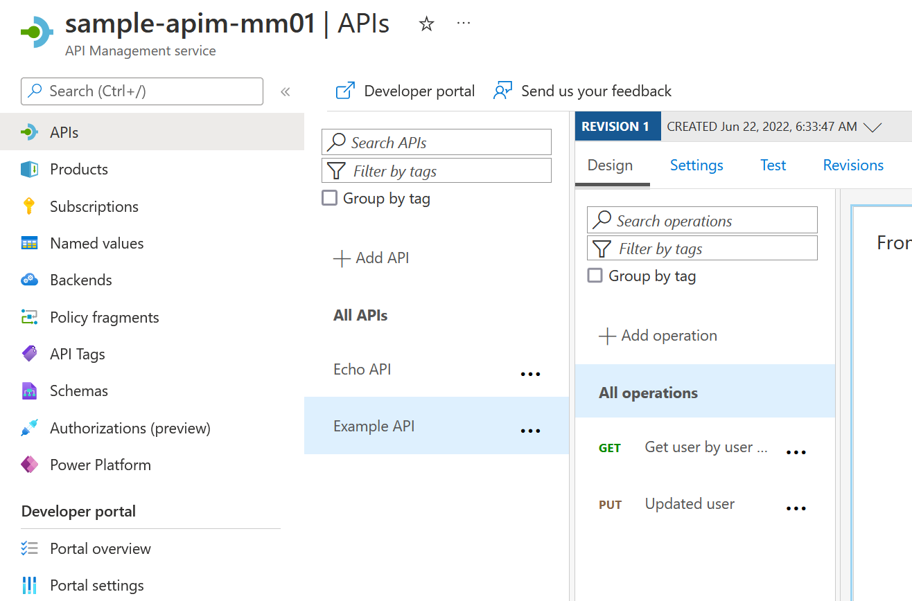

# Deploy API with OpenApi

Deploying an updated OpenAPI definition will also update the API Management API.

## Terraform

With [Terraform](https://registry.terraform.io/providers/hashicorp/azurerm/2.13.0/docs/resources/api_management_api), APIs can be created and existing OpenAPI definition can be used:

```terraform
resource "azurerm_api_management_api" "example" {
  name                = "example-api"
  resource_group_name = azurerm_resource_group.rg.name
  api_management_name = azurerm_api_management.example.name
  revision            = "1"
  display_name        = "Example API"
  path                = "example"
  protocols           = ["https"]

  import {
    content_format = "openapi"
    content_value  = file("${path.module}/example-api.yaml")
  }
}
```

## Create API

The API is initially created with [example-api.yaml](./example-api.yaml) containing only the path ```'/users/{username}'``` with a GET and PUT operation.
The OpenAPI definition is copied from: [https://github.com/Redocly/openapi-template/blob/gh-pages/openapi.yaml](https://github.com/Redocly/openapi-template/blob/gh-pages/openapi.yaml).

Execute Terraform:

```terraform plan```  

```terraform apply```

The API was created successfully:



## Update API

The OpenAPI definition is updated the additional  path / operation ```/echo```.  

Execute Terraform:

```terraform plan```
> Plan: 0 to add, 1 to change, 0 to destroy.  

```terraform apply```
> Apply complete! Resources: 0 added, 1 changed, 0 destroyed.

After deployment, the changes to the OpenAPI definition were deployed and the added operation _Echo test_ exists:


